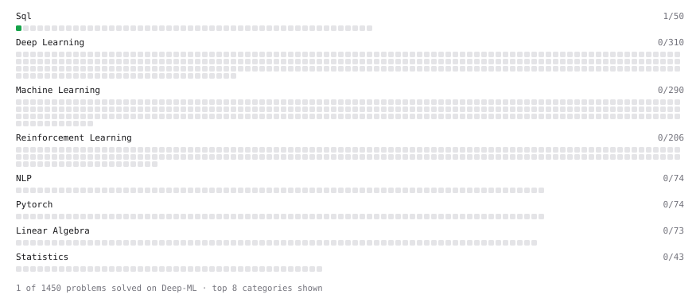

# Deep-ML

My machine learning practice from [Deep-ML](https://www.deep-ml.com). Every solution here was written by hand.

**3** solved · 1 problems · 0 labs · 2 math

[**Browse the interactive portfolio**](https://AryadipMridha.github.io/deep-ml/) to replay this filling in over time.

## Problems

| | Difficulty | Solved | |
| --- | --- | --- | --- |
| [SELECT all rows](https://www.deep-ml.com/problems/1101) | easy | 2026-09-24 | [solution](problems/1101-select-all-rows) |

## Math

| | Difficulty | Solved | |
| --- | --- | --- | --- |
| [Matrix Basics](https://www.deep-ml.com/math-problems/9) | easy | 2026-08-07 | [solution](math/0009-matrix-basics) |
| [Vector Operations](https://www.deep-ml.com/math-problems/7) | easy | 2026-08-06 | [solution](math/0007-vector-operations) |

---

_This file is regenerated by Deep-ML on every push._
